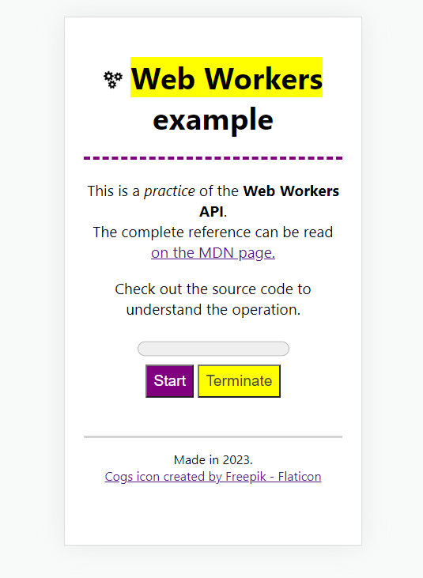

# Web Workers example

This is a practice of the Web Workers API.

The complete reference can be read [on the MDN page.](https://developer.mozilla.org/en-US/docs/Web/API/Web_Workers_API)

## Screenshot

This is how it looks on mobile.

## Usage

First use `npm install`. Then run `npm start`.

## License

Please read [the license file.](LICENSE)